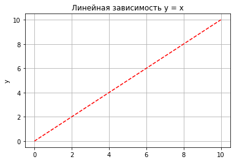

Matplotlib
============================

Introduction
------------

.. code:: ipython3

    # Магические команды Jupyter
    %matplotlib notebook #Интерактивный режим
    %matplotlib qt
    %matplotlib inline #Вывод в Jupyter'е

.. code:: ipython3

    import matplotlib.pyplot as plt
    
    X = range(100)
    Y = [value**2 for value in X]
    plt.plot(X, Y)
    plt.show()

The first line tells Python that we are using the matplotlib.pyplot
module. To save on a bit of typing, we make the name **plt** equivalent
to matplotlib.pyplot. This is a very common practice that you will see
in matplotlib code.

The fourth line plots a curve, where the x coordinates of the curve’s
points are given in the list X, and the y coordinates of the curve’s
points are given in the list Y. Note that the names of the lists can be
anything you like.

.. code:: ipython3

    x = np.linspace(0, 10, 50) 
    y = x
    plt.title('Линейная зависимость y = x') # заголовок plt.xlabel('x')     
    plt.ylabel('y')    # ось абсцисс  
    plt.grid()          # ось ординат # включение отображение сетки 
    plt.plot(x, y, 'r--') # построение графика

.. parsed-literal::

    [<matplotlib.lines.Line2D at 0x2c9380241f0>]

.. code:: ipython3

    import math
    import matplotlib.pyplot as plt
    T = range(100)
    X = [(2 * math.pi * t) / len(T) for t in T]
    Y = [math.sin(value) for value in X]
    plt.plot(X, Y)
    plt.show()

.. code:: ipython3

    import numpy as np
    import matplotlib.pyplot as plt
    X = np.linspace(-3, 2, 200)
    Y = X ** 2 - 2 * X + 1.
    plt.plot(X, Y)
    plt.show()

Plotting multiple curves
------------------------

.. code:: ipython3

    import numpy as np
    import matplotlib.pyplot as plt
    X = np.linspace(0, 2 * np.pi, 100)
    
    Ya = np.sin(X)
    Yb = np.cos(X)
    plt.plot(X, Ya)
    plt.plot(X, Yb)
    plt.show()

The two curves show up with a different color automatically picked up by
matplotlib.

We use one function call plt.plot() for one curve; thus, we have to call
plt.plot() here twice. However, we still have to call plt.show() only
once. The functions calls plt. plot(X, Ya) and plt.plot(X, Yb) can be
seen as declarations of intentions. We want to link those two sets of
points with a distinct curve for each.

matplotlib will simply keep note of this intention but will not plot
anything yet. The plt.show() curve, however, will signal that we want to
plot what we have described so far.

.. code:: ipython3

    # Линейная зависимость 
    x = np.linspace(0, 10, 50) 
    y1 = x # Квадратичная зависимость 
    y2 = [i**2 for i in x] # Построение графика 
    plt.title('Зависимости: y1 = x, y2 = x^2') # заголовок plt.xlabel('x')         
    # ось абсцисс 
    plt.ylabel('y1, y2')    
    plt.grid()              # ось ординат # включение отображение сетки 
    plt.plot(x, y1, x, y2)  # построение графика

.. parsed-literal::

    [<matplotlib.lines.Line2D at 0x2c9383c9b80>,
     <matplotlib.lines.Line2D at 0x2c9383c9be0>]

Deferred Rendering
------------------

This deferred rendering mechanism is central to matplotlib. You can
declare what you render as and when it suits you. The graph will be
rendered only when you call plt.show(). To illustrate this, let’s look
at the following script, which renders a bell-shaped curve, and the
slope of that curve for each of its points:

.. code:: ipython3

    import numpy as np
    import matplotlib.pyplot as plt
    
    def plot_slope(X, Y):
        Xs= X[1:] - X[:-1]
        Ys = Y[1:] - Y[:-1]
        plt.plot(X[1:], Ys / Xs)
    X = np.linspace(-3, 3, 100)
    Y = np.exp(-X ** 2)
    plt.plot(X, Y)
    plot_slope(X, Y)
    plt.show()

.. code:: ipython3

    Представление графиков на разных полях

.. code:: ipython3

    # Линейная зависимость
    x = np.linspace(0, 10, 50) 
    y1 = x # Квадратичная зависимость 
    y2 = [i**2 for i in x]
    
    # Построение графиков 
    plt.figure(figsize=(9, 9)) 
    plt.subplot(2, 1, 1) 
    plt.plot(x, y1)                 # построение графика 
    plt.title('Зависимости: y1 = x, y2 = x^2') # заголовок 
    plt.ylabel('y1', fontsize=14)   
    plt.grid(True)                  
    plt.subplot(2, 1, 2) 
    plt.plot(x, y2)                 
    plt.xlabel('x', fontsize=14)    
    plt.ylabel('y2', fontsize=14)   
    plt.grid(True)                  # ось ординат 
    # включение отображение сетки 
    # построение графика # ось абсцисс # ось ординат # включение отображение сетки

Здесь мы воспользовались новыми функциями:

• **figure()** - функция для задания глобальных параметров отображения
графиков. В нее, в качестве аргумента, мы передаем кортеж, определяющий
размер общего поля.

• **subplot()** - функция для задания местоположения поля с графиком.
Существует несколько способов задания областей для вывода графиков. В
примере мы воспользовались вариантом, который предполагает передачу трех
аргументов: первый аргумент- количество строк, второй - столбцов в
формируемом поле, третий- индекс (номер поля, считаем сверху вниз, слева
направо).

Построение облака точек
-----------------------

.. code:: ipython3

    import numpy as np
    import matplotlib.pyplot as plt
    data = np.random.rand(1024, 2)
    plt.scatter(data[:,0], data[:,1])
    plt.show()

Bar Chart
---------

**Диаграммы для категориальных данных**

.. code:: ipython3

    fruits = ['apple', 'peach', 'orange', 'bannana', 'melon']
    counts = [34, 25, 43, 31, 17]
    plt.bar(fruits, counts)
    plt.title('Fruits!')
    plt.xlabel('Fruit')
    plt.ylabel('Count')

.. parsed-literal::

    Text(0, 0.5, 'Count')

.. code:: ipython3

    import matplotlib.pyplot as plt
    data = [5., 25., 50., 20.]
    plt.bar(range(len(data)), data)
    plt.show()

.. code:: ipython3

    The thickness of a bar

.. code:: ipython3

    import matplotlib.pyplot as plt
    data = [5., 25., 50., 20.]
    plt.bar(range(len(data)), data, width = 1.)
    plt.show()

.. code:: ipython3

    Horizontal bars

.. code:: ipython3

    import matplotlib.pyplot as plt
    data = [5., 25., 50., 20.]
    plt.barh(range(len(data)), data)
    plt.show()

.. code:: ipython3

    Plotting multiple bar charts

.. code:: ipython3

    import numpy as np
    import matplotlib.pyplot as plt
    data = [[5., 25., 50., 20.],
     [4., 23., 51., 17.],
     [6., 22., 52., 19.]]
    X = np.arange(4)
    plt.bar(X + 0.00, data[0], color = 'b', width = 0.25)
    plt.bar(X + 0.25, data[1], color = 'g', width = 0.25)
    plt.bar(X + 0.50, data[2], color = 'r', width = 0.25)
    plt.show()

.. code:: ipython3

    import numpy as np
    import matplotlib.pyplot as plt
    data = [[5., 25., 50., 20.],
     [4., 23., 51., 17.],
     [6., 22., 52., 19.]]
    color_list = ['b', 'g', 'r']
    gap = .8 / len(data)
    for i, row in enumerate(data):
        X = np.arange(len(row))
        plt.bar(X + i * gap, row,
        width = gap,
        color = color_list[i % len(color_list)])
    plt.show()

.. code:: ipython3

    Plotting stacked bar charts

.. code:: ipython3

    import matplotlib.pyplot as plt
    A = [5., 30., 45., 22.]
    B = [5., 25., 50., 20.]
    X = range(4)
    plt.bar(X, A, color = 'b')
    plt.bar(X, B, color = 'r', bottom = A)
    plt.show()

.. code:: ipython3

    import numpy as np
    import matplotlib.pyplot as plt
    data = np.array([[5., 30., 45., 22.], [5., 25., 50., 20.],[1., 2., 1., 1.]])
    colorlist = ['b', 'g', 'r']
    
    X = np.arange(data.shape[1])
    for i in range(data.shape[0]):
        plt.bar(X, data[i],
        bottom = np.sum(data[:i], axis = 0),
        color = color_list[i % len(colorlist)])
    plt.show()

.. code:: ipython3

    Plotting back-to-back bar charts

.. code:: ipython3

    import numpy as np
    import matplotlib.pyplot as plt
    women_pop = np.array([5., 30., 45., 22.])
    men_pop = np.array( [5., 25., 50., 20.])
    X = np.arange(4)
    plt.barh(X, women_pop, color = 'r')
    plt.barh(X, -men_pop, color = 'b')
    plt.show()

.. code:: ipython3

    ## Plotting pie charts

.. code:: ipython3

    import matplotlib.pyplot as plt
    data = [5, 25, 50, 20]
    plt.pie(data)
    plt.show()

.. code:: ipython3

    ## Plotting histograms

.. code:: ipython3

    import numpy as np
    import matplotlib.pyplot as plt
    X = np.random.randn(1000)
    plt.hist(X, bins = 20)
    plt.show()

.. code:: ipython3

    ## Plotting boxplots

.. code:: ipython3

    import numpy as np
    import matplotlib.pyplot as plt
    data = np.random.randn(100)
    plt.boxplot(data)
    plt.show()
    

-  The red bar is the median of the distribution.
-  The blue box includes 50 percent of the data from the lower quartile
   to the upper quartile. Thus, the box is centered on the median of the
   data.
-  The lower whisker extends to the lowest value within 1.5 IQR from the
   lower quartile.
-  The upper whisker extends to the highest value within 1.5 IQR from
   the upper quartile.
-  Values further from the whiskers are shown with a cross marker.

.. code:: ipython3

    import numpy as np
    import matplotlib.pyplot as plt
    data = np.random.randn(100, 5)
    plt.boxplot(data)
    plt.show()

.. code:: ipython3

    ## Plotting triangulations

.. code:: ipython3

    import numpy as np
    import matplotlib.pyplot as plt
    import matplotlib.tri as tri
    data = np.random.rand(100, 2)
    triangles = tri.Triangulation(data[:,0], data[:,1])
    plt.triplot(triangles)
    plt.show()

.. image:: Matplotlib_files/Matplotlib_48_0.png

.. figure:: attachment:image.png
   :alt: image.png

   image.png

Корневым элементом при построении графиков в системе Matplotlib является
Фигура (Figure). Все, что нарисовано на рисунке выше является элементами
фигуры.

Рассмотрим ее составляющие более подробно. График На рисунке
представлены два графика - линейный и точечный. Matplotlib предоставляет
огромное количество различных настроек, которые можно использовать для
того, чтобы придать графику требуемый вид: задать цвет, толщину, тип,
стиль линии и многое другое, все это мы рассмотрим в ближайших уроках.

Вторым, после непосредственно самого графика, по важности элементом
фигуры являются оси. Для каждой оси можно задать метку (подпись),
основные (major) и дополнительные (minor) элементы шкалы, их подписи,
размер, толщину и диапазоны. Сетка и легенда Сетка и легенда являются
элементами фигуры, которые значительно повышают информативность графика.
Сетка может быть основной (major) и дополнительной (minor). Каждому типу
сетки можно задавать цвет, толщину линии и тип. Для отображения сетки и
легенды используются соответствующие команды.

.. code:: ipython3

    import matplotlib.pyplot as plt 
    from matplotlib.ticker import (MultipleLocator, FormatStrFormatter, AutoMinorLocator) 
    import numpy as np 
    x = np.linspace(0, 10, 10) 
    y1 = 4*x 
    y2 = [i**2 for i in x] 
    fig, ax = plt.subplots(figsize=(8, 6)) 
    ax.set_title('Графики зависимостей: y1=4*x, y2=x^2', fontsize=16) 
    ax.set_xlabel('x', fontsize=14) 
    ax.set_ylabel('y1, y2', fontsize=14) 
    ax.grid(which='major', linewidth=1.2) 
    ax.grid(which='minor', linestyle='--', color='gray', linewidth=0.5)
    
    ax.scatter(x, y1, c='red', label='y1 = 4*x')
    ax.plot(x, y2, label='y2 = x^2')
    ax.legend()
    ax.xaxis.set_minor_locator(AutoMinorLocator())
    ax.yaxis.set_minor_locator(AutoMinorLocator())
    ax.tick_params(which='major', length=10, width=2)
    ax.tick_params(which='minor', length=5, width=1)
    plt.show()

